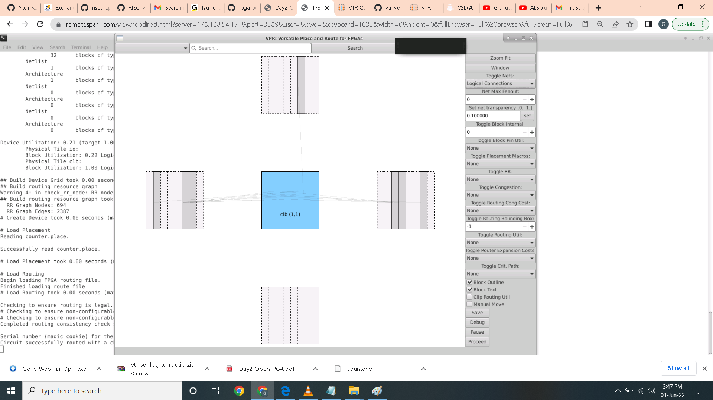
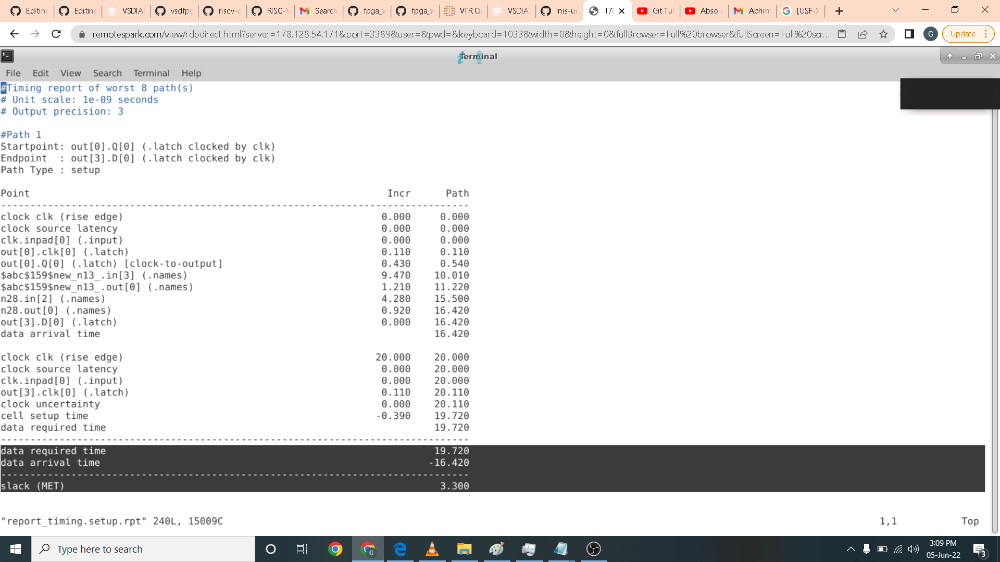

# FPGA - Fabric, Design and Architecture
FPGA - Fabric, Design and Architecture

### ABOUT THE WORKSHOP
The Workshop is a 5-day basic to advance program that is design for fresher and professional who wants to build a career in VLSI industry. It is a cloud based workshop that comprises of training courses that covers RISC-V specs, RISC-V software, How to implement RISC-V basic specs using TL-Verilog and Simulate your own RISC-V core. In short, you are going to write RTL and build RISC-V core on your own.
### AUTHOR OF THE WORKSHOP
#### Mr. Kunal Ghosh
Co-founder of VLSI System Design (VSD) Corporation Private Limited
#### 
### AGENDA
 [Day 1 Intro](#Day1-Intro)
  * [Part 1: FPGA introduction](#Part1-FPGA-introduction)
  * [Part 2: Vivado-counter](#Part2-Vivado-counter)
  * [Part 3: VIO Counter](#Part3-VIO-Counter)
 
 [Day OpenFPGA2](#Day2-OpenFPGA)
  * [Part 1: OpenFPGA Intro](#Part1-OpenFPGA-Intro)
  * [Part 2: VPR](#Part2-VPR)
  * [Part 3: VTR](#Part3-VTR)

 [Day 3 Introduction to RISC-V core programming on Vivado](#Day3-Introduction-to-RISC-V-core-programming-on-Vivado)
  * [Part 1: RVMyth vivado rtl-to-synthesis](#Part1-RVMyth-vivado-rtl-to-synthesis)
  * [Part 2: RVMyth Vivado synthesis-to-bitstream](#Part2-RVMyth-Vivado-synthesis-to-bitstream)

 [Day 4 Introduction to SOFA FPGA Fabric IP](#Day4-Introduction-to-SOFA-FPGA-Fabric-IP)
  * [Part 1: SOFA counter area](#Part1-SOFA-counter-area)
  * [Part 2: Fetch, decode, and execute logic](#Part2-SOFA-counter-timing)
  * [Part 3: SOFA counter post impl](#Part3-SOFA-counter-post-impl)
  * [Part 4: SOFA counter power](#Part4-SOFA-counter-power)

 [Day 5 RISC-V core on custom SOFA fabric](#Day5-RISC-V-core-on-custom-SOFA-fabric)
  * [Part 1: SOFA-RVMyth run](#Part1-SOFA-RVMyth-run)
  * [Part 2: SOFA-RVMyth timing and area](#Part2-SOFA-RVMyth-timing-and-area)
  * [Part 3: RVMyth-post impl netlist](#Part3-RVMyth-post-impl-netlist)
  * [Part 4: SOFA-RVMyth Vivado simulation](#Part4-SOFA-RVMyth-Vivado-simulation)
  
## Day1-Intro
## FPGA introduction

## Vivado counter

## VIO Counter

## Day OpenFPGA2
## Part 1: OpenFPGA Intro

## Part 2: VPR

## Part 3: VTR

## Day 3 Introduction to RISC-V core programming on Vivado
## Part 1: RVMyth vivado rtl-to-synthesis

## Part 2: RVMyth Vivado synthesis-to-bitstream

## Day 4 Introduction to SOFA FPGA Fabric IP
## Part1 SOFA counter area]

## Part2 SOFA counter timing]

## Part3 SOFA counter post impl

## Part4 counter power

