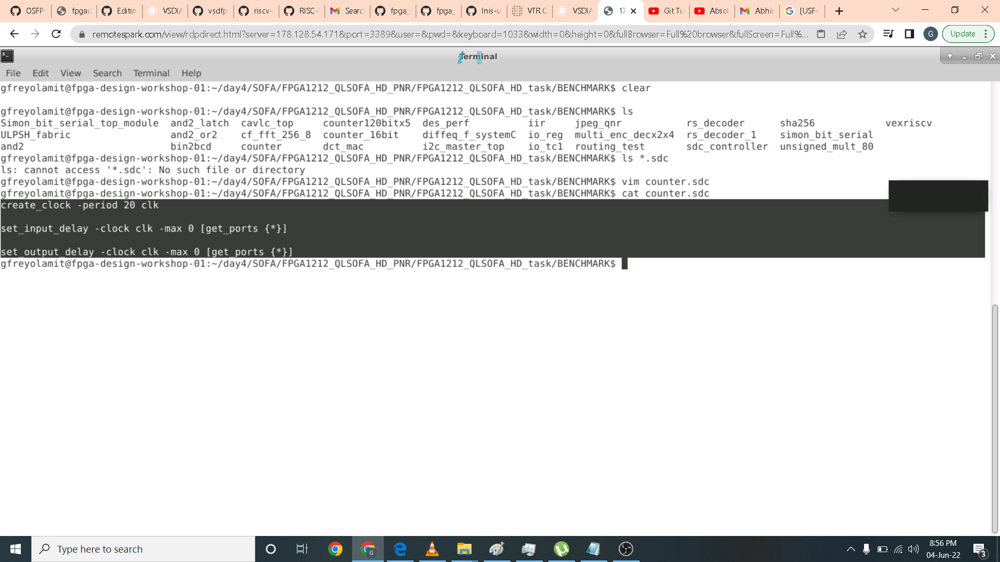

# FPGA - Fabric, Design and Architecture
FPGA - Fabric, Design and Architecture


### ABOUT THE WORKSHOP
The Workshop is a 5-day basic to advance program that is design for fresher and professional who wants to build a career in VLSI industry. It is a cloud based workshop that comprises of training courses that covers intro to FPGA, OpenFPGA, RISC-V core programming in Vivado, intro to SOFA FPGA Fabric IP and RISC-V core on custom SOFA fabric.
### AUTHOR OF THE WORKSHOP
#### Mr. Kunal Ghosh
Co-founder of VLSI System Design (VSD) Corporation Private Limited
#### Professor Nanditha Rao
#### 
### AGENDA
 [Day 1 Intro](#Day1-Intro)
  * [Part 1: FPGA introduction](#Part1-FPGA-introduction)
  * [Part 2: Vivado-counter](#Part2-Vivado-counter)
  * [Part 3: VIO Counter](#Part3-VIO-Counter)
 
 [Day OpenFPGA2](#Day2-OpenFPGA)
  * [Part 1: OpenFPGA Intro](#Part1-OpenFPGA-Intro)
  * [Part 2: VPR](#Part2-VPR)
  * [Part 3: VTR](#Part3-VTR)

 [Day 3 Introduction to RISC-V core programming on Vivado](#Day3-Introduction-to-RISC-V-core-programming-on-Vivado)
  * [Part 1: RVMyth vivado rtl-to-synthesis](#Part1-RVMyth-vivado-rtl-to-synthesis)
  * [Part 2: RVMyth Vivado synthesis-to-bitstream](#Part2-RVMyth-Vivado-synthesis-to-bitstream)

 [Day 4 Introduction to SOFA FPGA Fabric IP](#Day4-Introduction-to-SOFA-FPGA-Fabric-IP)
  * [Part 1: SOFA counter area](#Part1-SOFA-counter-area)
  * [Part 2: Fetch, decode, and execute logic](#Part2-SOFA-counter-timing)
  * [Part 3: SOFA counter post impl](#Part3-SOFA-counter-post-impl)
  * [Part 4: SOFA counter power](#Part4-SOFA-counter-power)

 [Day 5 RISC-V core on custom SOFA fabric](#Day5-RISC-V-core-on-custom-SOFA-fabric)
  * [Part 1: SOFA-RVMyth run](#Part1-SOFA-RVMyth-run)
  * [Part 2: SOFA-RVMyth timing and area](#Part2-SOFA-RVMyth-timing-and-area)
  * [Part 3: RVMyth-post impl netlist](#Part3-RVMyth-post-impl-netlist)
  * [Part 4: SOFA-RVMyth Vivado simulation](#Part4-SOFA-RVMyth-Vivado-simulation)
  
## Day1-Intro
## FPGA introduction
History of programmable logic
- Programmable logic devices:
   * PLA – Programmable logic arrays
   * CPLD – Complex programmable logic device
   * FPGA
- Generate customisable hardware
- Study the effect of area, speed, power of the digital circuits


What is an FPGA?
* A “field programmable” gate array: Integrated circuit designed to be configured by a designer. FPGA configuration is specified using HDL similar to an ASIC (application specific Integrated circuit). Logic design in FPGA is different it uses LUTs, Flip-flops, configurable logic blocks.

ASIC vs FPGA
- ASIC(Application Specific Integrated Circuit) is designed from RTL to layout. Layout must be sent to semiconductor foundary for fabrication. ASIC cannot be reprogrammed.
- FPGA (Field Programmable Gate Array) is designed from RTL to bitstream. Design programmed on the FPGA which is bought off-the-shelf. FPGA can be re-programmed.

- Applications
   - Hardware acceleration
   - Signal processing
   - Device controllers
   - Embedded systems
   - Aerospace
   - High performance computing
   - Machine learning

FPGA Architecture
- Configurable logic blocks (CLB)-- Implement combinatorial and sequential logic. Based on LUT and Flip-flop/latches
- Look-up Tables (LUT) which implement the logic functions using truth table
- Carry and Control Logic- Implements arithmetic operations
- Flip Flops (FFs)/ Latches
- Memory Elements
- Programmable I/O blocks - Configurable I/Os for external interface connections
- Programmable interconnect- Wires to connect inputs, CLBs

## Vivado counter


## VIO Counter

Different ways of programming
- Local programing on the Basys3 board
- Remote programing
   * Inputs through Virtual Input/Output and Outputs observed on the board
   * Inputs through Virtual Input/Output and Outputs observed on the Integrated Logic Analyzer (ILA)


## Day OpenFPGA2
## Part 1: OpenFPGA Intro

OpenFPGA

- To improve the design and development times of current methodologies to produce an FPGA which involve several hardware and software engineers and development for several months. OpenFPGA an Open source framework can be used to quickly generate a fabric for a custom FPGA (specific to your design).
   * Automation techniques used
   * Reduces FPGA development cycle of a new FPGA to a few days
   * Provides open source design tools

- Need for custom FPGAs?
   – Accelerate domain-specific applications: FPGA architectures have to be custom made, to provide maximum computing. Prototyping and producing a custom FPGA is costly and time-consuming.
   - Customise your own FPGA fabric using a set of templates (> 20 FPGA architectures- in xml files optimised for different applications)
   - Generates Verilog netlists describing an FPGA fabric based on an XMLbased description file: VPR’s (Versatile Place and Route) architecture description language
   - Allows you to write your own FPGA fabric (for a specific application) using OpenFPGA’s architecture description language
   - Automatically generates Verilog testbenches to validate the correctness of FPGA fabric
   - Bitstream generation support based on the same XML-based description file 

Running the tool
- The VTR detailed instruction can be found in this link: https://docs.verilogtorouting.org/en/latest/quickstart/
- In this workshop we don't have to Build OpenFPGA as it is done on cloud as well as build VTR.
- we can run VPR on a Pre-Synthesized Circuit and observe the result files then visualize (GUI) circuit implementation.
- Run the entire VTR flow automatically
    * Implement our own circuit in this workshop(counter.v) on a pre-existing FPGA architecture Earch.xml which can be found in $VTR_ROOT/vtr_flow/arch.
    * Use an automated approach (Odin II and ABC are automatically run) using python script
    * Perform timing simulation on the generated fabric

## Part 2: VPR
- To run VPR on a Pre-Synthesized Circuit you can check this link for more detailed information https://docs.verilogtorouting.org/en/latest/vpr/
   * Packing (combines primitives into complex blocks)
   * Placement (places complex blocks within the FPGA grid)
   * Routing (determines interconnections between blocks)
   * Analysis (analyzes the implementation)
   
● Input files are Blif file and Earch.xml

```
$VTR_ROOT/vpr/vpr \
> $VTR_ROOT/vtr_flow/arch/timing/EArch.xml \
> $VTR_ROOT/vtr_flow/benchmarks/blif/tseng.blif \ 
> --route_chan_width 100
```

Run VPR on a Pre-Synthesized Circuit

- BLIF Netlist (.blif) - The technology mapped circuit to be implement on the target FPGA is specified as a Berkely Logic Interchange Format (BLIF) netlist. The netlist must be flattened and consist of only primitives (e.g. .names, .latch, .subckt). Clock and delay constraints can be specified with an SDC File.
- Outputs:
   - .net file: The circuit .net file is an xml file that describes a post-packed user circuit. It represents the user netlist in terms of the complex logic blocks of the target architecture. This file is generated from the packing stage and used as input to the placement stage in VPR.


## Part 3: VTR
VTR
- To check installation:
```
$VTR_ROOT/vtr_flow/scripts/run_vtr_task.py basic_flow
```
– Expected output: 
```
k6_N10_memSize16384_memData64_40nm_timing/ch_intrinsics...OK
```
- To run command VTR for Counter input the following command:
```
$VTR_ROOT/vtr_flow/scripts/run_vtr_flow.py \
> $VTR_ROOT/doc/src/quickstart/counter.v \
> $VTR_ROOT/vtr_flow/arch/timing/EArch.xml \
> -temp_dir . \
> --route_chan_width 100
```
- To open GUI for above design
```
$VTR_ROOT/vpr/vpr \
   > $VTR_ROOT/vtr_flow/arch/timing/EArch.xml \
   > counter --circuit_file counter.pre-vpr.blif \
   > --route_chan_width 100 \
   > --analysis --disp on
```


● To run VPR for Post implimentation netlist timing simulation
- We need to provide the vpr --gen_post_synthesis_netlist option to generate the post-implementation netlist and dump the timing information in Standard Delay Format(SDF):
```
$VTR_ROOT/vpr/vpr \
> $VTR_ROOT/vtr_flow/arch/timing/EArch.xml \
> counter.pre-vpr.blif --gen_post_synthesis_netlist on
```


## Day 3 Introduction to RISC-V core programming on Vivado
In this lab we implemented RISC-V core in BASYS3 FPGA Board using Xilinx Vivado. We first import the RISC-V verilog code and its testbench by clcning this link https://github.com/shivanishah269/risc-v-core.git in our local directory in the cloud. We then open vivado using command prompt by invoking command ```vivado```. The Xilinx Vivado opens and I created and named my new project as Project_RISCV. After creating the project I then proceed in importing the design source file in this case mythcore_test.v can be found in this link https://github.com/nandithaec/fpga_workshop_collaterals/blob/main/Day3/mythcore_test_no_ILA.v and the test file test.v using this https://github.com/nandithaec/fpga_workshop_collaterals/blob/main/Day3/test.v. It is important to note to check the checkbox for automatic import file to have your own local copy of the files in your project. I then choose the board package in this case BASYS3.
## Part 1: RVMyth vivado rtl-to-synthesis
I did edit this line that I highlighted from the original code to match the design source RISCV module input and output parameters.

I then run behavioral simulation by clicking the run button on the left side pane. A new window for simulation popup and I expand the window. Here as shown I change the run time parameter to 10ms to get enough sample of time for the RISC-V to execute. I then press the x cursor arrow then minus button to get zoom in to the waveform. Here as you can see it takes 675ns to completely execute a simple application which which adds 1 to 9 in RISC-V core.

I then add an Integrated Logic Analyzer using IP catalog in the upper left portion of the window. I use 2 input with 1 bit and 8 bit width each. I then add the command generated in verilog to the design source and match the corresponding parameters.

The next phase is elaboration. Press the open elaboration design button below RTL analysis then a pop up named Elaborated Design will show up press ok. The package window will show up at the bottom of the lane there is an io pin window in it you can configure the io pin assignment of each signal. In my case I assign clock to w5 pin and reset in R2 pin with 3.3vcc as shown.

After that I open the constraints wizard and use 100 Mhz clock then click skip to finish. A window summary is generated as shown below.

## Part 2: RVMyth Vivado synthesis-to-bitstream
After sdc file is setup correctly I run synthesis. After synthesis is completed I open design synthesis and click the corresponding reports that I want to see. Here I want to see the utilization report. In it we only use 9 percent of LUTs, 7 percent of flipflop and 3 percent of RAM in implementing the RISCV processor in BASYS3 board.


I then click the schematic option below synthesis design. The schematic for RISCV processor are shown.

I then more to implementation phase by clicking open implementation design. A device window will apprear and in it is the implemented RISCV in BASYS3 architecture.

I then zoom in to the hardware implementation.

You can also highlight which part of the implemented design you want to see.

I also take a look at the timing summary. Here I do not have setup and hold violations as they are all positive.

The last phase is the generate bitstream. Here I do not have the board BASYS3 and the cloud also does not have a fpga board connected. This part is where you program the board you selected.


## Day 4 Introduction to SOFA FPGA Fabric IP
SOFA overview

https://github.com/lnis-uofu/SOFA
https://skywater-openfpga.readthedocs.io/en/latest/
Skywater Opensource FPGAs
- SOFA (Skywater Opensource FPGAs) are a series of open-source FPGA IPs using the open-source Skywater 130nm PDK and  OpenFPGA framework.
- Open-source embedded FPGA IP library, from the architecture description to production ready layouts.

HD eFPGAs - The High Density (HD) FPGAs are embedded FPGAs built with the Skywater 130nm High Density Standard Cell library (Sky130_fd_SC_HD).

Commands to be run by user on cloud
- In this workshop OpenFPGA is already installed in the cloud and its path is exported.
- Now run the following to install SOFA and make sure it is working:
  * git clone https://github.com/lnis-uofu/SOFA.git
  * cd FPGA1212_QLSOFA_HD_PNR
  * make runOpenFPGA
## Part1 SOFA counter area]
In this lab we are going to implement counter using SOFA. I open the task_simulation.conf in the config folder and edit the following parameters: the source code to use. in this case counter.v file, layout 12x12, channel width 60 and bench top level is counter.

I then edit the generate_testbench.openfpga for the command counter timing part to this command below.
```
vpr ${VPR_ARCH_FILE} ${VPR_TESTBENCH_BLIF} --clock_modeling ideal --device ${OPENFPGA_VPR_DEVICE_LAYOUT} --route_chan_width ${OPENFPGA_VPR_ROUTE_CHAN_WIDTH} --absorb_buffer_luts off
```


Directory Organization
- Keep this folder clean and organized as follows
  * DOC: documentation of the project
  * ARCH: Architecture XML and other input files which OpenFPGA requires to generate Verilog netlists
  * BENCHMARK: Benchmarks to be tested on the FPGA fabric
  * HDL: Hardware description netlists for the FPGA fabrics
  * SDC: design constraints
  * SCRIPT: Scripts to setup, run OpenFPGA etc.
  * TESTBENCH: Verilog testbenches generated by OpenFPGA
  * PDK: Technology files linked from skywater opensource pdk
  * SNPS_ICC2: workspace of Synopsys IC Compiler 2 Keep a README inside the folder about the ICC2 version and how-to-use.
  * MSIM: workspace of verification using Mentor ModelSim
Below is the code inside vpr_archi.xml

Here I am navigating the file hirarchy and run OpenFPGA. A task execution completed is shown.

I then open the log files which can be found in this directory /home/gfreyolamit/day4/SOFA/FPGA1212_QLSOFA_HD_PNR/FPGA1212_QLSOFA_HD_task/latest/vpr_arch/up_counter/MIN_ROUTE_CHAN_WIDTH

This is the information inside openshellfpga.log. It also log the errors. In this case we dont have any.

Another log file that is very important in debugging is the vprstd.log file. Below is the portion of the log that it has.

## Part2 SOFA counter timing]
In the vprstd.log file we can see the circuit statistics. In it is the number of blocks, nets and netlist blocks.

You can also find the logic elements and the Pb types it use.

To generate timing report we need to add sdc file as shown in the BENCHMARK folder.

I then open generatetestbench.openfpga.

Then input the following commands 
```
vpr ${VPR_ARCH_FILE} ${VPR_TESTBENCH_BLIF} --clock_modeling ideal --device ${OPENFPGA_VPR_DEVICE_LAYOUT} --route_chan_width ${OPENFPGA_VPR_ROUTE_CHAN_WIDTH} --absorb_buffer_luts off --sdc_file /home/gfreyolamit/day4/SOFA/FPGA1212_QLSOFA_HD_PNR/FPGA1212_QLSOFA_HD_task/BENCHMARK/counter.sdc
```

After running the openFPGA again. A log and report files has been generated. 

However I made a mistake here since I did not use the upcounter.v instead I use counter.v which is wrong. That is why I got a slack violation because I use the wrong file which requires longer time required.

After editing and copying the upcounter.v file in the BENCHMARK folder I also updated the corresponding config file parameters as shown.

I also updated the generate_testbench.openfpga file as shown.

I then open the setup report and get a positive slack.

I also did not get a violation for hold report.

## Part3 SOFA counter post impl
For the counter post implementation. I edit the generate_testbench.openfpga with this command.
```
vpr ${VPR_ARCH_FILE} ${VPR_TESTBENCH_BLIF} --clock_modeling ideal --device ${OPENFPGA_VPR_DEVICE_LAYOUT} --route_chan_width ${OPENFPGA_VPR_ROUTE_CHAN_WIDTH} --absorb_buffer_luts off --sdc_file /home/gfreyolamit/day4/SOFA/FPGA1212_QLSOFA_HD_PNR/FPGA1212_QLSOFA_HD_task/BENCHMARK/counter.sdc --gen_post_synthesis_netlist on
```

After execution of runOpenFPGA an up_counter_post_synthesis.v is generated as shown.

. I highlighted the module instantiation as this should match the parameters of the testbench we are going to use in simulation.

Here I highlighted the clock which must match with the primitives.v clock parameter.

For the post simulation I use xilinx vivado. I named the project SOFAupcounter.

I then imported the design source file and its corresponding testbench as shown in the source window.


Here is the simulation result as expected the counter counts from 0 to 15 which is equivalent to hexadecimal F then goes back to 0 after one clock cycle.


## Part4 counter power
Here I open the upcounter.act that is generated in the post implementation stage in SOFA.

I then edit the generate_testbench.openfpga file with the following command.
```
vpr ${VPR_ARCH_FILE} ${VPR_TESTBENCH_BLIF} --clock_modeling ideal --device ${OPENFPGA_VPR_DEVICE_LAYOUT} --route_chan_width ${OPENFPGA_VPR_ROUTE_CHAN_WIDTH} --absorb_buffer_luts off   --power --activity_file /home/gfreyolamit/day4/SOFA/FPGA1212_QLSOFA_HD_PNR/FPGA1212_QLSOFA_HD_task/latest/vpr_arch/up_counter/MIN_ROUTE_CHAN_WIDTH/up_counter_ace_out.act   --tech_properties /home/gfreyolamit/vtr-verilog-to-routing/vtr_flow/tech/PTM_45nm/45nm.xml
```

I also edit the file vpr_arch.xml file and add the following command just below the complexblocklist code.
```
<!-- added for power analysis  -->
<power>
    <local_interconnect C_wire="2.5e-10"/>
    <mux_transistor_size mux_transistor_size="3"/>
    <FF_size FF_size="4"/>
    <LUT_transistor_size LUT_transistor_size="4"/>
  </power>
  <clocks>
    <clock buffer_size="auto" C_wire="2.5e-10"/>
  </clocks>
</architecture>
```

I edit the layout size to auto and the channel width to 150 in the task_simulaiton.conf as shown.

After the execution of runOpenFPGA a up_counter.power files has been generated in the /home/gfreyolamit/day4/SOFA/FPGA1212_QLSOFA_HD_PNR/FPGA1212_QLSOFA_HD_task/latest/vpr_arch/up_counter/MIN_ROUTE_CHAN_WIDTH/ directory.

Inside it is the total and breakdown of power consumption of each blocks as highlighted.


## Day 5 RISC-V core on custom SOFA fabric
## Part1 SOFA-RVMyth run
In this lab we are going to create a custom FPGA for RISC-V processor using Skywater 130nm PDK and OpenFPGA framework.
To start with we have to edit the generate_testbench.openfpga file with the following code.
```
vpr ${VPR_ARCH_FILE} ${VPR_TESTBENCH_BLIF} --clock_modeling ideal --device ${OPENFPGA_VPR_DEVICE_LAYOUT} --route_chan_width ${OPENFPGA_VPR_ROUTE_CHAN_WIDTH} --absorb_buffer_luts off
```

For the task_simulation.conf file I change the layout parameter to auto and channel width to 180nm. I did added the source file in the folder rvmyth which is inside the BENCHMARK folder as shown in the path parameter. And change the bench0_top to core.

In the vpr_arch.xml I uncommment the line 156 and 157 and line 259.

After executing the runOpenFPGA I got no errors in the openfpgashell.log

I also did not receive error in the vpr_std.log as highlighted.

## Part2 SOFA-RVMyth timing and area
Looking in the circuit statistics generated in the vpr_std.log file. The RVMyth uses 5492 blocks. The detailed are as shown. We can confirm that this is correct as it has 2 inputs which is the clock and reset and eight output which is the 8 bit output.

The logic element that RVmyth uses are highlighted below.

For timing analysis, we need to add sdc file inside the rvmyth folder which is inside the BENCHMARK folder. Then edit the generate_testbench.openfpga file as shown with this code. 
```
vpr ${VPR_ARCH_FILE} ${VPR_TESTBENCH_BLIF} --clock_modeling ideal --device ${OPENFPGA_VPR_DEVICE_LAYOUT} --route_chan_width ${OPENFPGA_VPR_ROUTE_CHAN_WIDTH} --absorb_buffer_luts off --sdc_file /home/gfreyolamit/day4/SOFA/FPGA1212_QLSOFA_HD_PNR/FPGA1212_QLSOFA_HD_task/BENCHMARK/rvmyth/mythcore.sdc
```
In the sdc file I use the clock of 200ns since the rvmyth core is a complex logic.

After executing the runOpenFPGA the reports and logs were created. The setup report has positive slack therefore no slack violations.

I also past the hold report by a very small margin as shown below.

I then check the openfpgashell.log for possible errors and there are none.

Same with vpr_std.log file. No errors were reported.


## Part3 RVMyth-post impl netlist
To generate post implementation netlist for RVMyth I just edited the generate_testbench.openfpga with the following command.
```
vpr ${VPR_ARCH_FILE} ${VPR_TESTBENCH_BLIF} --clock_modeling ideal --device ${OPENFPGA_VPR_DEVICE_LAYOUT} --route_chan_width ${OPENFPGA_VPR_ROUTE_CHAN_WIDTH} --absorb_buffer_luts off --sdc_file /home/gfreyolamit/day4/SOFA/FPGA1212_QLSOFA_HD_PNR/FPGA1212_QLSOFA_HD_task/BENCHMARK/rvmyth/mythcore.sdc --gen_post_synthesis_netlist on
```
I the execute the runOpenFPGA and a core_post_synthesis.v is generated in this directory /home/gfreyolamit/day4/SOFA/FPGA1212_QLSOFA_HD_PNR/FPGA1212_QLSOFA_HD_task/latest/vpr_arch/up_counter/MIN_ROUTE_CHAN_WIDTH

Looking inside the code I highlighted the inputs and outputs parameter of core module as this has to match the testbench for the simulation in vivado.

I also highlighted the clock parameter as this will be used by the primitives.v file and the clock must match.


## Part4 SOFA-RVMyth Vivado simulation
The start the post simulation of the RVMyth in the vivado I added the testbench first inside the rvmyth folder. I also make sure that it matches the parameter of the rvmyth core we generated.

The primitives.v clock matches with the rvmyth desigh source as highlighted.

Here I imported the design files and the test file as shown.

The simulation is now ready.

Here it takes 682 ns for the RVMyth to execute the command.

Here I try to run power analysis and input the following commands. Although this part is not covered in the workshop I try to generate power analysis report as I was curious.

I did several attempts and check the debug and I got errors. I was told by Professor Nanditha Rao that generation of power analysis is complex so I just giveup.


## Acknowledgement

- Professor Nandith Rao
- Sir Kunal Ghosh
